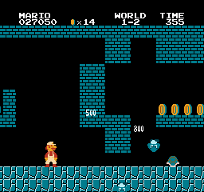
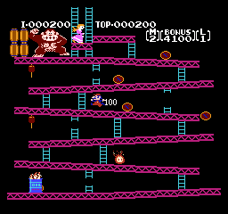

### Badnes

My personal emulator project written in Zig.
This is in a very in-development state, and this is almost certainly not a good example of code quality right now (if it ever will be).
I'm not looking for issues/prs as it's not meant for anyone else to really use at the moment, I just wanted my code out there in case someone else finds it useful when making their own emulator

### Screenshots

### Dependencies

- [Zig](https://ziglang.org/)
- [SDL2](https://www.libsdl.org/download-2.0.php) for video, audio, etc.

### Status/TODO

#### Internals

Mappers:

- [x] SRAM
- [x] NROM / Mapper 000
- [x] MMC1 / Mapper 001
- [ ] UxROM / Mapper 002
- [ ] CNROM / Mapper 003
- [x] MMC3 / Mapper 004
- [ ] MMC5 / Mapper 005

Few games are supported at the moment

CPU:

- [x] Accurate documented instructions
- [ ] Undocumented instructions
- [x] Separate fast and accurate implementations

PPU:

- [x] Works with simple games
- [x] Seperate fast and accurate implementations
- [x] Accurate version is accurate
    - [x] Usable
- [x] Fast version is fast
    - [ ] Usable

APU:

- [x] Triangle channel
- [x] Pulse channels
- [x] Noise channel
- [ ] DMC
- [ ] Separate fast and accurate implementations

IO:

- [x] Player 1 controller
- [ ] Player 2 controller
- [ ] NES accessories

Spaghetti code:

- [ ] None
- [x] A little
- [x] A decent amount
- [x] Lots
- [x] All-encompassing

#### UX

SDL Implementation:

- [x] Video
- [x] Audio
- [ ] Good/clean audio implementation
- [x] Input
- [ ] After-launch rom loading
- [ ] Settings
- [ ] Debug tools
    - [ ] Cpu
    - [ ] Ppu
    - [ ] Apu
    - [ ] Memory

Wasm:

- [ ] ???
